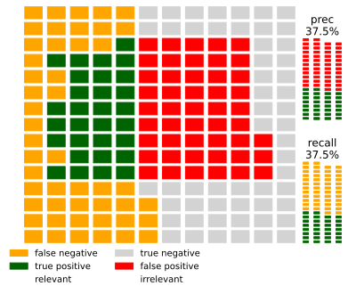

#  Recall me Maybe

Recall me maybe is an open source, MIT-licensed Python package for plotting recall precision waffle charts from 
a confusion matrix.

We believe it is a good tool to make precision/recall visually intuitive and have helpful mental images of your
model results.


## Installation

```python
pip install git+https://github.com/lbruand/recall-me-maybe#egg=recallme
```

## Requirements


* Python 3.5+
* Matplotlib
* Numpy

## Example

```python
import recallme.recallme
import numpy as np
```

```python

cm = np.array([[4, 1],
               [2, 2]])
hmap = recallme.recallme.build_waffle_matrix_from_confusion_matrix((10, 10), cm)
fig = recallme.recallme.plot_waffle_matrix(hmap, cm)
fig.savefig("output/recall-me-maybe.svg", bbox_inches='tight')
```

